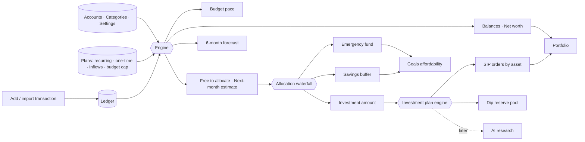
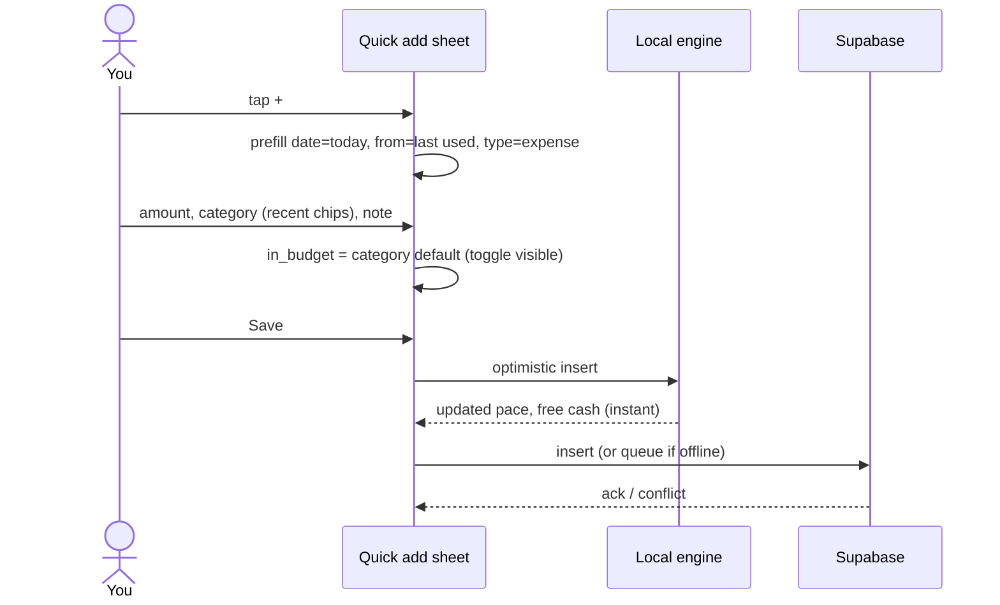
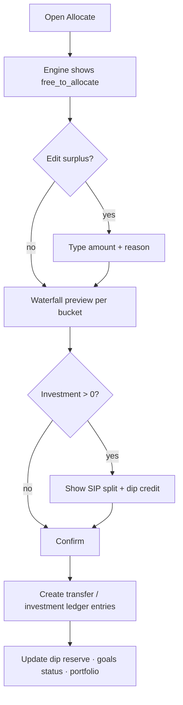

# Personal Finance OS — Architecture & Technical Plan

*Replaces `Finance-Mng-V2.xlsx` + `Investment_Portfolio_Allocation_Tracker.xlsx` with one mobile-first web application.*

**Storage:** `03_Database_SQLite.md` supersedes every mention of Dexie / IndexedDB / Supabase as the system of record in this file. Product formulas, entities, and screens below still apply. Build order is `plan.md`.

---

## 1. Vision

One app, one data model, one plan:

1. **Record** every rupee movement once (the Ledger).
2. **See** where this month stands (budget pace, bills due, free cash) and where the next six months are heading.
3. **Allocate** whatever is left over using a fixed, editable long-term rule: fill the Emergency Fund → top up the Savings buffer → put everything else into Investments.
4. **Invest** the investment share using a configurable plan (SIP pool vs. dip reserve, asset weights, theme engine, dip-buy priority).
5. **Track** goals ("can I afford this now?") and net worth / portfolio.
6. **Later**: let an AI layer research funds, spot dips, and write a monthly review.

### Non-negotiable design principles (carried over from your sheets)

| Principle | Where it came from | What it means in the app |
|---|---|---|
| Ledger is the only source of truth | Configuration → Rules 1, 6, 7, 8 | No screen ever lets you type a balance. Balances = opening + ledger. Fix mismatches with a Reconciliation entry, never by editing. |
| Planning never posts to the ledger | Planned Expenses sheet header | Recurring / one-time / expected-inflow rows are *forecast only*. They affect "Free to allocate" and the 6-month view, never balances. |
| Direction is From → To, amount is always positive | Rules 2, 3 | Every transaction is a transfer between two accounts (real or virtual: Employer, Expense, External). |
| Include-in-budget is a per-transaction flag with a category default | Rule 4, 5; Categories "Typical Budget?" | Category gives the default; the flag can be overridden on any entry. |
| Free cash must already net out commitments | Simple Dashboard "Free to allocate" | Liquid − budget still reserved − CC due − remaining EMI this month − planned one-time (30 d). |
| Money for anything needed in < 2–3 years stays out of the market | Investment Config, Milestone 3 note | Goals with near timelines are funded from the Savings bucket / FD, never from the Investment bucket. |

---

## 2. What each spreadsheet becomes

| Sheet today | App module | Notes |
|---|---|---|
| Ledger | **Ledger** (transactions) | Same columns; Excel serial dates become ISO dates. `Source` column kept for import provenance. |
| Configuration → Accounts | **Accounts** | Type (Asset/Liability/Virtual), opening balance, credit limit, net-worth flag, liquid flag, group. |
| Configuration → Categories | **Categories** | Group + default budget flag; editable list. |
| Configuration → Budget default, Salary | **Settings → Money** | Default monthly budget, expected monthly salary, salary day. |
| Monthly Budget | **Budget** | Only the cap is manual; everything else derived. Per-month override kept. |
| Reconciliation | **Accounts → Reconcile** | Calculated vs. actual, difference, last reconciled, guided fix flow (add missing txn or Adjustment). |
| Planned Expenses → Recurring | **Plans → Recurring** | Frequency, start/end, active, kind (Loan/EMI · Lifestyle · Investment), payment account. |
| Planned Expenses → One-time | **Plans → One-time** | Expected date, priority, status (Planned / Completed / Cancelled). |
| Planned Expenses → Expected inflows | **Plans → Inflows** | Amount, liquid?, status; excluded from free cash until they hit the ledger. |
| Simple / Detailed Dashboard | **Home** + **Insights** | Pace, CC due, free to allocate, next-month estimate, 6-month forecast, spend by category, net worth. |
| Investment Config (milestones, buckets) | **Allocate** | Replaced by an ordered bucket waterfall (Emergency Fund → Savings → Investment). Milestones removed; each bucket has a target and fill rule instead. |
| Goal Fund | **Goals** | Goal-level priority, timeline, target, funded-so-far, affordability status. |
| Investing sheet | **Invest → Plan** | Monthly amount comes from the Investment bucket; SIP % / dip reserve %, asset weights, theme engine tiers, dip-buy priority — all editable. Gold removed from the default asset list (it's just a row you can delete). |
| — (new) | **Portfolio** | Holdings, current value, allocation drift vs. plan, net worth history. |
| — (new, later) | **AI research** | Fund research, dip alerts, monthly review. |

---

## 3. System architecture

### 3.1 Layers

```
┌───────────────────────────────────────────────────────────────┐
│  PWA client (mobile browser first)                            │
│  React + TypeScript · Tailwind · Recharts · IndexedDB cache   │
│  Runs the same calculation engine locally for instant UI      │
├───────────────────────────────────────────────────────────────┤
│  API / backend                                                 │
│  Supabase (Postgres + Auth + Row Level Security)               │
│  Edge functions for: import, snapshots, scheduled jobs, AI     │
├───────────────────────────────────────────────────────────────┤
│  Shared package  @finance/engine  (pure TypeScript, no I/O)    │
│  balances · budget pace · free cash · forecast · waterfall ·   │
│  investment split · goal affordability · net worth             │
├───────────────────────────────────────────────────────────────┤
│  Jobs (cron)                                                   │
│  nightly snapshot · month rollover · NAV refresh (later) ·     │
│  AI research run (later) · reminders                           │
└───────────────────────────────────────────────────────────────┘
```

Why this shape:

* **Engine as a pure package.** Every number the spreadsheets compute becomes a pure function `(inputs) → outputs`. It runs in the browser (instant, offline) *and* on the server (snapshots, notifications, AI context). One implementation, testable with fixtures exported from your current sheets.
* **Postgres + RLS.** Single user today, but RLS keeps it safe if you ever share with family. Postgres gives you real date math and materialised monthly views.
* **PWA.** Installable to the phone home screen, works offline for reads and queued writes, no app-store friction.

### 3.2 Component diagram

```mermaid
flowchart TB
    subgraph Client["PWA client"]
        UI[Screens]
        LocalEngine[Engine (local)]
        Cache[(IndexedDB cache + outbox)]
        UI --> LocalEngine
        UI <--> Cache
    end

    subgraph Backend["Supabase"]
        API[REST / RPC]
        DB[(Postgres)]
        Auth[Auth]
        Fn[Edge functions]
        API --> DB
        Fn --> DB
    end

    subgraph Jobs["Scheduled jobs"]
        Snap[Nightly snapshot]
        Roll[Month rollover]
        NAV[NAV refresh - later]
        AI[AI research - later]
    end

    Cache <-->|sync| API
    UI --> Auth
    Jobs --> Fn
    AI --> LLM[LLM API + web search]
    NAV --> MF[Fund NAV source]
```

### 3.3 Data flow (the spine)



---

## 4. Domain model

All amounts stored as **integer paise** (₹ × 100) to avoid float drift; displayed as ₹. All dates ISO (`YYYY-MM-DD`); months as `YYYY-MM`.

### 4.1 Entities

```mermaid
erDiagram
    ACCOUNT ||--o{ LEDGER_ENTRY : from
    ACCOUNT ||--o{ LEDGER_ENTRY : to
    CATEGORY ||--o{ LEDGER_ENTRY : categorises
    ACCOUNT ||--o{ RECONCILIATION : checks
    MONTH_BUDGET ||--o{ LEDGER_ENTRY : scopes
    RECURRING_PLAN }o--|| CATEGORY : uses
    ONE_TIME_PLAN }o--|| CATEGORY : uses
    BUCKET ||--o{ ALLOCATION_RUN_LINE : receives
    ALLOCATION_RUN ||--|{ ALLOCATION_RUN_LINE : has
    GOAL ||--o{ GOAL_CONTRIBUTION : funded_by
    LEDGER_ENTRY o|--o{ GOAL_CONTRIBUTION : realises
    INVEST_PLAN ||--|{ INVEST_ASSET : weights
    INVEST_PLAN ||--o{ INVEST_THEME : tiers
    INVEST_ASSET ||--o{ HOLDING : tracked_as
    HOLDING ||--o{ HOLDING_TXN : built_from
    LEDGER_ENTRY o|--o| HOLDING_TXN : realises
    SNAPSHOT }o--|| ACCOUNT : values
```

### 4.2 Field-level spec

**account**
`id, name, type (asset|liability|virtual), opening_balance, opening_date, credit_limit?, include_net_worth, include_liquid, group (savings|cash|credit_card|fd|investment|virtual), bucket_id? (which allocation bucket this account "belongs" to — e.g. ICICI Savings → Savings bucket, FD → Emergency Fund), statement_day?, due_day?, is_archived, notes`

**category**
`id, name, group, default_in_budget, icon?, is_archived, sort`

**ledger_entry**
`id, date, time?, type (income|expense|transfer|cc_payment|refund|investment|adjustment), amount, from_account_id, to_account_id, category_id, in_budget (bool), notes, source (manual|excel|statement|recurring_auto), goal_id?, holding_txn_id?, created_at, updated_at`

Validation rules mirror your Type Guide: `income` requires from=virtual Employer/External; `expense` requires to=virtual Expense; `cc_payment` requires to.type=liability; `investment` requires to.group∈{fd,investment}; `adjustment` requires category=Reconciliation.

**month_budget**
`month (YYYY-MM, PK), budget_cap, note`  — created lazily from `settings.default_budget` when a month is first viewed.

**recurring_plan**
`id, name, category_id, frequency (monthly|yearly|weekly|custom_months), amount, start_date, end_date?, active, kind (loan_emi|lifestyle|investment), pay_from_account_id?, notes, auto_post (bool, default false), last_posted_month?`

`auto_post` is the one deliberate departure from the sheet: if on, the month rollover job *proposes* a ledger entry you confirm with one tap (never posts silently).

**one_time_plan**
`id, name, category_id, expected_date, amount, priority (high|medium|low), status (planned|completed|cancelled), pay_from_account_id?, notes, linked_ledger_entry_id?`

**expected_inflow**
`id, name, category_id, expected_date, amount, is_liquid (bool), status (expected|received|dropped), notes, linked_ledger_entry_id?`

**reconciliation**
`id, account_id, checked_at, calculated_balance, actual_balance, difference, resolution (none|added_txn|adjustment), notes`

**bucket** (allocation destinations — you'll have exactly three, but the model allows more)
`id, name, priority (1..n), target_amount?, target_rule (fixed|months_of_expenses), target_months?, fill_mode (until_target|percent|fixed|remainder), fill_value?, min_monthly?, active, notes, colour`

Default seed:
| priority | name | target_rule | fill_mode |
|---|---|---|---|
| 1 | Emergency Fund | 6 × avg monthly essentials | until_target |
| 2 | Savings buffer | fixed (e.g. ₹30,000 hard cash) | until_target |
| 3 | Investment | — | remainder |

**allocation_run** — one per month (re-runnable)
`id, month, surplus_input (free_to_allocate at run time, or manual override), override_reason?, created_at, status (proposed|confirmed)`

**allocation_run_line**
`id, run_id, bucket_id, proposed_amount, confirmed_amount?, ledger_entry_id? (the transfer that realised it)`

**goal**
`id, name, target_amount, target_date?, priority (1..n), funding_bucket_id (usually Savings), status (active|paused|achieved|dropped), notes, icon?`

**goal_contribution**
`id, goal_id, date, amount, ledger_entry_id? (optional link to a real transfer/FD), note`

**invest_plan** (single row, versioned by `effective_from`)
`id, effective_from, sip_pct, dip_reserve_pct, theme_threshold_amount, notes`

**invest_asset**
`id, plan_id, name, kind (core|theme), target_pct, instrument_note (e.g. "Motilal Oswal Nasdaq 100 FoF"), dip_priority (int), active`

Seed (your current sheet minus Gold): NASDAQ-100 25%, India Flexicap 15%, Nifty 50 7.5%, Nifty Next 50 7.5%, AI Infrastructure 15% (theme), Automation & Robotics 9% (theme), Electricity & Grid 6% (theme), Defense & Cyber 5% (theme). Weights are re-normalised in the UI when you remove Gold's 10%.

**invest_theme_rule**
`id, plan_id, below_amount → allowed_asset_ids[]` — the "Theme engine": below ₹20,000 → only AI Infrastructure among themes; above → all themes active. Stored as tiers so you can add more.

**dip_reserve_ledger** — virtual pool
`id, month, credit (from run), debit (dip buy), balance_after, note, ledger_entry_id?`

**holding**
`id, asset_id, account_id (Mutual Fund / Demat), units, avg_cost, last_nav?, last_nav_date?, current_value (derived)`

**holding_txn**
`id, holding_id, date, kind (buy_sip|buy_dip|sell|dividend), units, nav, amount, ledger_entry_id`

**snapshot** (nightly)
`date, account_id, balance` + `net_worth_daily(date, assets, liabilities, liquid, invested, ef_balance, savings_balance)`

**settings**
`default_budget, monthly_salary, salary_day, currency, week_start, ef_months (default 6), essentials_categories[] (used for EF target), notification_prefs, ai_enabled`

---

## 5. Calculation engine — the formulas, translated

Everything below is a pure function; inputs are the tables above plus `today`.

### 5.1 Balances
```
asset.balance      = opening + Σ(to == acct) − Σ(from == acct)
liability.due      = opening + Σ(from == acct) − Σ(to == acct)
cc.available       = credit_limit − due
cc.utilisation     = due / credit_limit
liquid_cash        = Σ balance where include_liquid
```

### 5.2 Budget pace (this month)
```
budget_spent       = Σ expense in month where in_budget
budget_remaining   = cap − budget_spent
days_left          = days_in_month − day_of_month + 1
safe_per_day       = max(0, budget_remaining) / days_left
used_pct           = budget_spent / cap
elapsed_pct        = day_of_month / days_in_month
pace               = used_pct <= elapsed_pct ? "on track"
                   : used_pct <= elapsed_pct + 0.10 ? "watch"
                   : "over pace"
```

### 5.3 Monthly summary (Monthly Budget sheet)
```
income             = Σ income in month
non_budget_exp     = Σ expense in month where !in_budget
investments        = Σ investment in month
emis               = Σ expense in month where category == EMIs
rent               = Σ expense in month where category == Rent
cc_payments        = Σ cc_payment in month
est_savings        = income − budget_spent − non_budget_exp − investments
```
(Rent and EMIs are shown separately but are already inside `budget_spent` or `non_budget_exp` depending on their flag — never double-count.)

### 5.4 Planned commitments
```
recurring_due(month, kind)   = Σ amount for active plans where
                                 frequency==monthly && start<=month_end && (end null || end>=month_start)
                              + Σ amount for yearly plans whose anniversary month == month
committed_emi_remaining      = recurring_due(this_month, loan_emi) − Σ already paid this month (matched by category EMIs)
one_time_30d                 = Σ one_time.amount where status==planned && expected_date <= today+30
one_time_90d                 = same with 90
```

### 5.5 Free to allocate (the number the whole app pivots on)
```
budget_reserved    = max(0, budget_remaining)
committed_cash     = cc_total_due + committed_emi_remaining + one_time_30d
free_to_allocate   = liquid_cash − budget_reserved − committed_cash
```
Expected inflows are **not** added (matches your sheet: "do not spend against this until it credits"). The UI shows them greyed as "if received: +₹X".

### 5.6 Next-month estimate
```
est_free_next      = free_to_allocate
                   − recurring_due(next_month, loan_emi)
                   + settings.monthly_salary
                   − month_budget(next_month).cap
```

### 5.7 Six-month forecast
For m in next 6 months: `{loan_emi, lifestyle, investment, total}` from `recurring_due(m, kind)`, plus a running projected liquid balance:
```
projected_liquid[m] = projected_liquid[m-1] + salary − cap − recurring_due(m,*) − one_time(m) + inflows_received_assumption(m)
```
with a toggle "assume expected inflows arrive".

### 5.8 Allocation waterfall
```
surplus = run.surplus_input        // default: free_to_allocate, editable
for bucket in buckets ordered by priority where active:
    room = bucket.target ? max(0, bucket.target − bucket.current_balance) : ∞
    want = fill_mode == until_target ? room
         : fill_mode == percent      ? surplus_original × fill_value
         : fill_mode == fixed        ? fill_value
         : /* remainder */             surplus
    give = min(want, room, surplus)
    line[bucket] = give
    surplus -= give
```
`bucket.current_balance` = Σ balances of accounts tagged to that bucket (EF = FD accounts + EF savings sub-account; Savings = ICICI Savings hard cash; Investment = Mutual Fund account). EF target when `target_rule = months_of_expenses` = `ef_months × trailing-3-month average of (in-budget spend + rent + EMIs in essentials categories)`.

Confirming a run creates the matching **transfer / investment ledger entries** (e.g. HDFC Savings → FD ₹X, HDFC Savings → Mutual Fund ₹Y). Until confirmed it's a proposal.

### 5.9 Investment plan engine
```
monthly_invest     = line[Investment bucket]
sip_pool           = monthly_invest × sip_pct
dip_pool_credit    = monthly_invest × dip_reserve_pct
allowed_themes     = theme_rule.tier_for(monthly_invest_or_portfolio_value)
active_assets      = core assets ∪ allowed_themes
weights            = normalise(target_pct over active_assets)
sip_order[asset]   = sip_pool × weights[asset]        // rounded to ₹1, remainder to largest
dip_reserve.balance += dip_pool_credit
```
Dip buy: user (or later AI) triggers "deploy dip reserve ₹N" → suggested order follows `dip_priority` (1 AI Infra, 2 NASDAQ-100, 3 Nifty Next 50, 4 Flexicap …) with an editable split.

### 5.10 Goal affordability
```
funded          = Σ goal_contribution.amount
remaining       = target − funded
available_now   = balance(funding_bucket) − Σ remaining of higher-priority active goals sharing that bucket
months_left     = months_between(today, target_date)
needed_per_month= remaining / max(1, months_left)
status =
  remaining <= 0                          → achieved
  available_now >= remaining              → "affordable now"
  months_left && needed_per_month <= expected_monthly_into_bucket → "on track"
  months_left                              → "behind — need ₹needed_per_month/mo"
  else                                     → "saving"
```
`expected_monthly_into_bucket` comes from the last allocation run.

### 5.11 Net worth
```
assets      = Σ balances of include_net_worth assets (+ holdings current_value for MF/demat if NAV known, else ledger cost)
liabilities = Σ dues of include_net_worth liabilities
net_worth   = assets − liabilities
```
Nightly snapshot → history chart.

---

## 6. Key flows

### 6.1 Add a transaction (the 10-second path)


### 6.2 Month rollover (1st of month, job)
1. Create `month_budget` for the new month from default cap (if absent).
2. For recurring plans with `auto_post`: generate **proposed** ledger entries → push notification "3 recurring payments to confirm".
3. Compute `free_to_allocate`; create a **proposed** `allocation_run`.
4. Home shows an "Allocate this month" card until you confirm.

### 6.3 Allocation run (manual, any time)


### 6.4 Reconcile an account
1. Open account → "Reconcile" → enter actual balance from the bank app.
2. Difference ≠ 0 → two buttons: **Find missing transaction** (opens ledger filtered to this account since last reconciled) or **Add adjustment** (pre-filled `adjustment` entry, category Reconciliation, mandatory note).
3. Difference = 0 → stamp `last_reconciled = today`.

### 6.5 Change the investment plan
Editing weights/percentages creates a **new plan version** (`effective_from = today`). Past allocation runs keep pointing at the version they used, so history stays honest. A "what-if" preview shows this month's SIP split under the new weights before you save.

### 6.6 Goal lifecycle
Create (name, target, date, priority, bucket) → status computed live → "Fund now" button appears when affordable → tapping creates a contribution (and optionally an FD transfer in the ledger) → achieved when funded ≥ target.

---

## 7. Recommended tech stack

| Layer | Choice | Why | Alternative |
|---|---|---|---|
| Frontend | **React 18 + TypeScript + Vite**, PWA plugin | Fast, huge ecosystem, easy PWA | SvelteKit (lighter), Next.js (if you want SSR later) |
| Styling | **Tailwind CSS** + a small headless component kit (Radix / shadcn) | Mobile-first utilities, bottom sheets, dialogs | — |
| State / data | **TanStack Query** for server state, **Zustand** for UI state | Caching, optimistic updates, offline retry | — |
| Charts | **Recharts** | Simple, responsive | Chart.js |
| Local storage | **IndexedDB via Dexie** | Offline reads + write outbox | — |
| Backend | **Supabase** (Postgres, Auth, RLS, Edge Functions, cron) | Zero-ops, SQL views for monthly aggregates, free tier fits a single user | Firebase (weaker for relational/date math); self-hosted Postgres + Hono |
| Engine | `packages/engine` pure TS, tested with **Vitest** | Same code in browser and Edge Functions | — |
| Hosting | **Vercel** or Netlify (static PWA) + Supabase cloud | Free tiers | Cloudflare Pages |
| Auth | Supabase email + magic link / passkey; PIN or biometric lock on device | You're the only user; keep it simple | — |
| Import | **SheetJS** in an Edge Function (or client) | Reads your two .xlsx directly | — |
| AI (later) | Anthropic API via Edge Function; web search tool for fund research | Server-side keys, structured JSON output | — |

Monorepo layout:
```
/apps/web            PWA
/packages/engine     pure calc functions + fixtures from your sheets
/packages/db         SQL migrations, generated types
/supabase/functions  import-xlsx, month-rollover, snapshot, ai-research
```

---

## 8. API surface (Supabase RPC / REST)

| Endpoint | Purpose |
|---|---|
| `GET /ledger?month=&account=&category=&q=` | paginated transactions |
| `POST /ledger`, `PATCH /ledger/:id`, `DELETE` | CRUD (soft delete with `deleted_at`) |
| `GET /accounts/balances` | SQL view: opening + ledger per account |
| `POST /reconcile` | record check + optional adjustment |
| `GET /month/:yyyymm/summary` | budget pace + monthly summary + CC due |
| `GET /free-cash` | free_to_allocate + breakdown + next-month estimate |
| `GET /forecast?months=6` | recurring due by kind + projected liquid |
| `GET/PUT /plans/recurring`, `/plans/one-time`, `/plans/inflows` | planning tables |
| `GET/PUT /buckets` | waterfall config |
| `POST /allocation/run` → proposal; `POST /allocation/:id/confirm` | waterfall |
| `GET/PUT /invest/plan` (versioned), `GET /invest/split?amount=` | investment engine |
| `POST /invest/dip-buy` | deploy dip reserve |
| `GET/POST /goals`, `POST /goals/:id/contribute` | goals |
| `GET /portfolio`, `GET /networth/history` | portfolio + snapshots |
| `POST /import/xlsx` | migration |
| `GET /export.xlsx` / `.csv` | you can always leave |

Most reads are **Postgres views** (`v_account_balance`, `v_month_summary`, `v_recurring_due`) so the same SQL serves the app and any future BI.

---

## 9. Migration from the two workbooks

1. **Accounts & categories** from `Configuration` (names, types, flags, opening balances). Opening date = 2026-08-01 (your "Aug-only start").
2. **Ledger**: all rows; Excel serial → date (`serial − 25569` days since 1970-01-01, e.g. 46235 → 2026-08-01). Map `Include in Budget` blank → category default. Keep `Source = excel`.
3. **Month budgets**: from `Monthly Budget` (all ₹31,000 today).
4. **Recurring / one-time / inflows** from `Planned Expenses` including `Kind`, `Active`, statuses.
5. **Reconciliation** last-checked rows as first `reconciliation` records.
6. **Buckets**: seed the three buckets; map ICICI Savings → Savings, FD → Emergency Fund, Mutual Fund → Investment.
7. **Investment plan** from `Investing`: sip 70/30, assets and weights, theme tiers, dip priority. Gold row imported but marked inactive so you can delete it explicitly.
8. **Goals** from `Goal Fund`: German Exams, Germany Relocation, MacBook Air, iPhone (targets blank → prompt to fill).
9. **Validation report** after import: every account's calculated balance vs. the sheet's — must match to the paisa before you trust the app.

Import is idempotent (hash of row) so you can re-run it while you keep using the sheet during the transition.

---

## 10. Security, privacy, backup

* All data behind Supabase Auth + RLS (`user_id = auth.uid()` on every table).
* Device lock: PIN/biometric via WebAuthn before showing balances; "privacy blur" toggle for numbers on Home.
* Nightly export job writes an encrypted `.xlsx` + `.json` snapshot to Supabase Storage; manual export any time.
* Soft deletes + audit columns; never hard-delete ledger rows.
* No bank credentials stored in v1. Statement import (v2) is file-upload based, parsed locally where possible.

---

## 11. Roadmap

| Phase | Scope | Definition of done |
|---|---|---|
| **0 — Engine + import** (2–3 wks) | `packages/engine` with fixtures from both sheets; Supabase schema; `import-xlsx` | Every dashboard number in the sheet reproduced by the engine within ₹1 |
| **1 — MVP: replace Finance-Mng** (3–4 wks) | Home, Quick add, Ledger, Accounts + Reconcile, Budget, Plans, 6-month forecast, Settings, PWA install | You stop opening the Excel file |
| **2 — Allocate + Goals + Invest** (3 wks) | Buckets waterfall, allocation run → ledger, Goals with affordability, Investment plan editor + SIP split + dip reserve | Month-end allocation done in-app, one tap to confirm |
| **3 — Portfolio & Net worth** (2 wks) | Holdings, manual NAV/value update, snapshots, net-worth history, allocation drift | Portfolio screen answers "what am I worth, where is it" |
| **4 — Automation** (2 wks) | Recurring auto-propose, reminders (CC due, EMI, reconcile), bank/CC statement CSV/PDF import with dedupe | Fewer than 5 manual entries/week |
| **5 — AI layer** (ongoing) | Fund research briefs, dip detection vs. reserve, monthly review narrative, "explain this number", natural-language add ("₹240 swiggy on icici cc") | You trust it enough to read before investing |

---

## 12. Future: AI research layer — design notes

* Runs **server-side on schedule** (weekly research, daily dip check) and **on demand** from the Invest screen.
* Inputs: your plan version, holdings, dip-reserve balance, allowed themes, last 30 days of NAVs, web search results.
* Outputs are **structured JSON** stored in `ai_insight (id, kind, created_at, payload, status)` and rendered as cards — never free text pasted into numbers.
* Kinds: `fund_brief` (per asset: expense ratio, tracking error, AUM, 1y/3y returns, risk flags), `dip_alert` (asset down ≥ X% from 30-day high → suggested deployment from reserve following dip priority), `monthly_review` (what changed, pace, allocation vs plan, one action), `rebalance_suggestion` (drift > 5 pp).
* Guardrails: AI **proposes**, you confirm; every proposal shows its sources; nothing posts to the ledger automatically.
* Natural-language capture: "₹240 swiggy icici cc" → parsed to a pre-filled quick-add sheet (still one tap to save).

---

## 13. Open decisions (answer before Phase 1)

1. **Opening balance date** — keep 2026-08-01 or backfill older history?
2. **Savings buffer target** — fixed ₹ (e.g. 30k) or "1 month of budget cap"?
3. **EF target basis** — 6 × trailing essentials, or a fixed ₹ you set?
4. **Do goals draw from Savings only**, or can a high-priority goal pause EF filling?
5. **Auto-post recurring** on by default or off?
6. **Single user forever?** If yes, RLS can stay simple and you can skip an org/household model.
